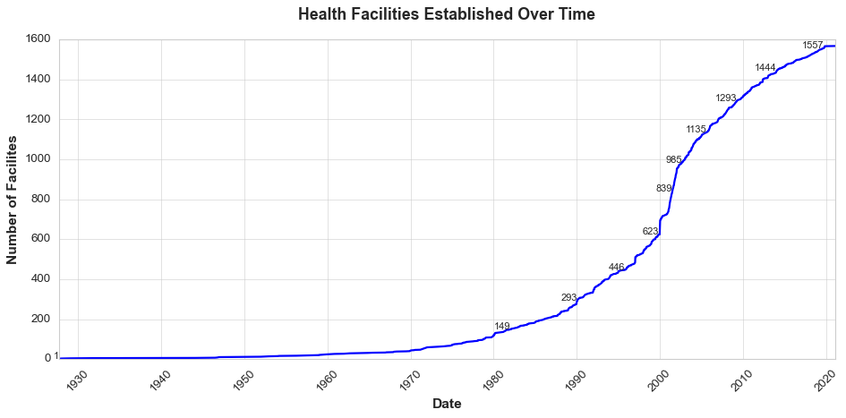

# Kaduna Health Infrastructure Analysis

## Project Overview

The Goal of this analysis is to identify and report health infrastructure needs of the state if any.
The data details the health facilities in Kaduna state with the LGAs they've been established in when they were established, the operational status of the facilities, the licensing and registration status, and the ownership of the health facilities.

## Key Findings

#### General Observations:
- Establishment of health facilities have seen a gradual increase in Kaduna State since 1970 as shown below

- Igabi LGA has the highest population in Kaduna State

- **91%** of the health facilities in Kaduna are Operational.
- **76%** of the health facilities in Kaduna are Registered and Licensed.
- Most of the health facilities (**77%**) in Kaduna are Publicly owned, while **22%** are privately owned.

#### Operation Status:

![[operation status over time.png]]

- Chikun LGA has the most health facilities in the state according to the data, it and Kaduna North LGA have the most health facilities that are operational
- Igabi LGA also has the most fully constructed health facilities that are non operational.

![[Total Number of Facilities 1.png]]

![[Number Operational Facilities'.png]]

![[LGAs with facilities pending registration.png]]

- LGAs with all health facilities operational: Kachia, Sanga, Soba, Kaduna South, Kajuru, Ikara, Kaura, Kudan, Sabon Gari
- LGAs with operations problems: Lere, Chikun, Igabi, Kaduna North, Giwa, Jema'a, Zangon Kataf, Zaria, Kagarko, Kubau, Birnin Gwari, Kauru, jaba, Makarfi
- Igabi has a terrible infrastructure problem, **92%** of health facilities in Igabi are non operational even when it has the highest population in the state.

#### Registration Status:

![[Overall Registration Status.png]]

- Igabi LGA might have the most non operational facilities, but most of the facilities in Igabi are registered.

![[Registered LGAs.png]]

- Despite Lere LGA having one of the most health facilities operational in the state, it has the least registered health facilities, on the basis that registration is not applicable to  **91%** of the health facilities in the LGA.

![[LGAs with not Applicable Registration Status.png]]

- The registration status of some health facilities in the state are undefined/unknown, this is prominent mostly in Chikun, Zangon Kataf, and Kaduna North LGAs

![[LGAs with unknown Registration Status.png]]

- Jema'a LGA has the most health facilities with their registration still pending.

![[Pending Registration LGAs.png]]

- Sanga, Kubau and Kagoro LGAs have health Facilities where their registration was suspended.

#### Licensing Status:

![[Overall License Status Counts.png]]

- Igabi LGA has the most health facilities with a license which is still weird why most of them are  not operational.

![[Licensed LGAs.png]]

- Chikun LGA has the most health facilities with unverified licensing, which might need to be checked given most of those facilities are operational.

![[LGAs with unknown License Status.png]]

- Lere LGA has the most health facilities where licensing is not applicable.
- Jema'a LGA has the most health facilities without a license.

#### Ownership of health Facilities:
- Kaduna North has the most private health facilities than any other LGA where **70%** of the facilities there are private.
- Lere LGA has the most public health facilities than any other LGA where **92%** of the facilities there are public.
- Jaba LGA has **96%** of it's health facilities owned by the public.
- The ratio of public to private health facilities whose operations are pending is **5:1**

#### Facility Levels:
- All tertiary health facilities are operational.
- **92.5%** of secondary health facilities are operational.
- **9.7%** of primary health facilities are not operational.

---

## Thoughts and Recommendations

The health infrastructure of Kaduna State shows historical sustainability and is poised to continue in this light.

However the registration and licensing system needs to be further looked into and well documented. There should be well defined guidelines for health facilities to be registered and obtain their license, LGAs like Chikun that have a lot of operational facilities will help secure their position and maintain confidence in their operations.

Igabi LGA needs to be seriously assessed for all issues that may be obstructing fully constructed and registered facilities from being operational, because only **8%** of the health facilities in Igabi are in direct proximity serving the most populated LGA in Kaduna. Other LGAs should be looked into too, especially why most of the health facilities have been constructed and are being delayed from operating.

There could also be incentive to encourage the establishment and registration of private health facilites given their success in Kaduna North.

---
## Tools Used
- Python for data analysis
- Pandas for data manipulation
- Matplotlib/Seaborn for visualization

#### How I cleaned this data:
- Dropped all duplicate rows
- Filled all missing values in the `registration_status` column with "Unknown"
- Filled all missing values in the `license_status` column with "Unknown"
- Deleted the `reg_number` column due to too many missing values.
- Corrected the mixed up dates in the `start_date` column and converted it to datetime format. Also filled all missing dates with randomly generated dates in the year 2000. Did this because 2000 was already the most popular year.

#### Constraints:
- Location data of the facilities are inaccurate, will not be able to draw any actionable insights based on longitude and latitude, the were also a lot of missing values.
- Data was last updated on Oct. 30th 2019, analysis was conducted in 2024.
- Due to method of data cleaning, exact numbers might not be represented in this analysis, will focus on overall variables and percentages.

